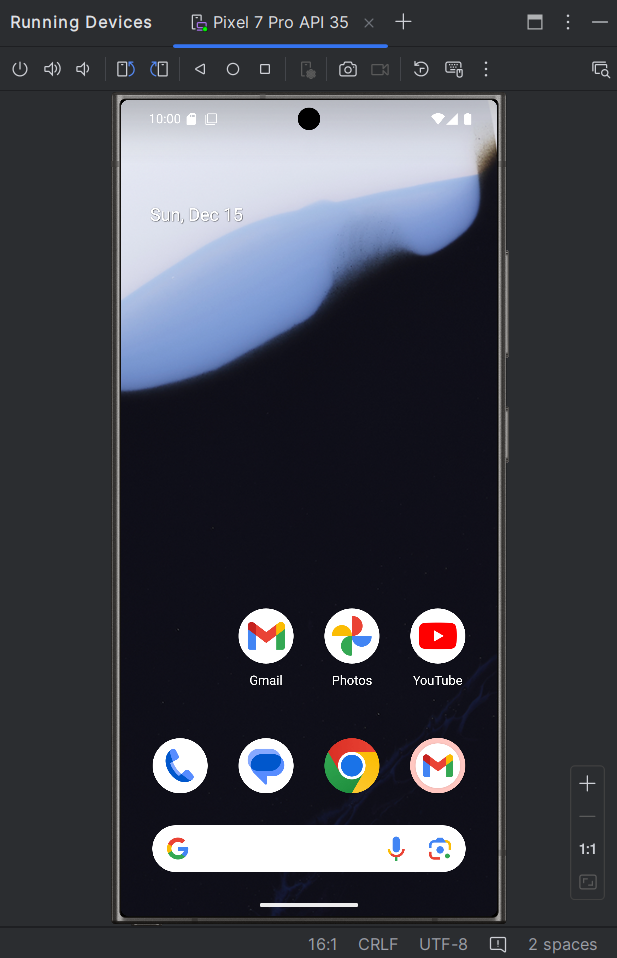

# Galaxy_S24Ultra_Skin
 Samsung Galaxy S24 Skin for Android Emulator
 Clone the repository and select the folder in, Android Studio -> Device Manager -> Edit -> Advanced Options -> Enable Device Frame
 Optimal for Devices with resolution 1440x3120  (eg:- Pixel 7 Pro) 

